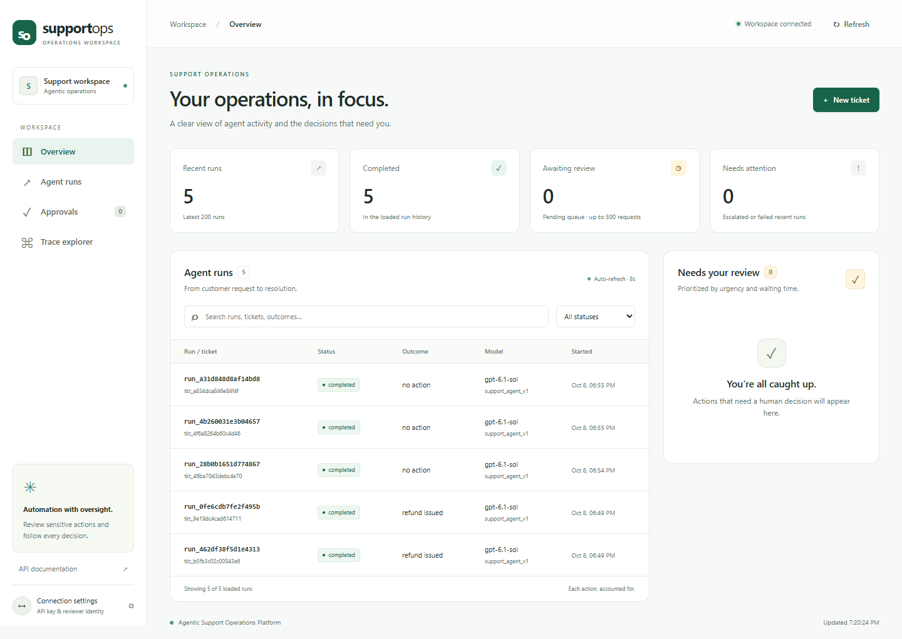

# Agentic Support Operations Platform

[](https://github.com/AbdlrhmanDev/Agentic-Support-Operations-Platform/actions/workflows/ci.yml)

A stateful AI support agent that resolves customer tickets end to end: it looks up the order, retrieves the relevant policy, takes the action the policy allows (refund, replacement, account change, escalation), pauses for a human on high-risk actions, and records every model call, tool call and guard decision.



*The operations console showing local demo runs. Open a run to inspect its full decision trace.*

The product requirements are in [02_agentic_support_ops_PRD.md](02_agentic_support_ops_PRD.md).

**Completion status:** the core MVP is implemented, but not every PRD and repository
requirement is complete. The [requirements audit](docs/requirements-audit.md) maps
requirements to code and tests, and lists the remaining safety, recovery and
observability gaps separately from optional stretch goals.

## How it works

```text
Web console ─> FastAPI ─> RunService ─> LangGraph workflow ─> Tool layer ─> Services ─> PostgreSQL
                                             │                                           ├─ business tables
                                             ├─ model (OpenAI, behind one interface)     ├─ run checkpoints
                                             └─ approval queue (pause / resume)          ├─ policy chunks (pgvector)
                                                                                         └─ trace events
```

The workflow is an explicit graph in [app/agent/graph.py](app/agent/graph.py):

```text
agent ──> gate ──> execute ──┐
  ▲         │  └─> approval ─┤   pauses until a reviewer decides
  └─────────┴────────────────┘
agent ──> finalize                       the reply is ready
agent / execute ──> escalate ──> finalize   a limit was hit: hand to a human
```

- **agent** asks the model for its next move.
- **gate** validates each proposed tool call and asks the business rules whether it may run. The verdict is allow, needs approval, or deny.
- **approval** creates an approval request and stops the run. The state is checkpointed in PostgreSQL, so the run resumes from the same point when a reviewer approves or rejects, even after a restart.
- **execute** is the only node that runs tools, and only calls the gate cleared.
- **escalate** hands the ticket to a human without asking the model. It is the fail-closed path for repeated tool failures, a runaway loop or an unusable model.

## Safety model

The model proposes; code decides. The rules below are enforced in `app/services/` and `app/tools/`, not in the prompt.

| Rule | Where |
| --- | --- |
| Refund eligibility, amounts, the automatic limit (100.00) and the hard cap (1000.00) | [app/services/refunds.py](app/services/refunds.py) |
| A write above a limit needs an approved request that matches the exact run, action and payload | [app/services/authorization.py](app/services/authorization.py) |
| Refund and replacement writes use keys derived from run, tool and arguments; other write paths have narrower duplicate suppression | [app/tools/base.py](app/tools/base.py), [remaining idempotency gaps](docs/requirements-audit.md#remaining-gaps-in-priority-order) |
| Refunds on one order are serialised by a row lock, so concurrent calls cannot exceed the balance | [app/services/refunds.py](app/services/refunds.py) |
| A run can only see and act on the orders of the customer who opened the ticket | [app/services/orders.py](app/services/orders.py) |
| Tool arguments are validated by Pydantic with unknown fields rejected | [app/tools/write.py](app/tools/write.py) |
| Read tools and write tools are separate; every write tool must declare a decision rule | [app/tools/base.py](app/tools/base.py) |
| No tool accepts SQL or field names; all queries go through the ORM | `app/services/` |
| Customer text, policy text and tool results are treated as data, never as instructions | [app/agent/prompts/support_agent_v2.md](app/agent/prompts/support_agent_v2.md) |

All limits are settings in [app/config.py](app/config.py), driven by environment variables.

## Tools

| Tool | Kind | Notes |
| --- | --- | --- |
| `get_customer`, `list_customer_orders`, `get_order` | read | Scoped to the ticket's customer |
| `search_policy` | read | Vector search over the policy documents |
| `calculate_refund` | read | The authority on eligibility and amount |
| `issue_refund` | write | Pauses for approval above the automatic limit |
| `create_shipping_replacement` | write | Pauses for approval above 150.00 |
| `update_customer_email` | write | Always pauses for approval |
| `update_ticket`, `escalate_to_human` | write | No financial risk; always allowed |
| `create_approval_request` | write | Lets the agent ask a reviewer for a policy exception |

## Quick start

Requires Docker, [uv](https://docs.astral.sh/uv/) and Python 3.12.

### With Docker

```bash
cp .env.example .env           # set OPENAI_API_KEY
docker compose up --build      # migrates, seeds demo data, serves on :8000
```

Open <http://localhost:8000> for the console, or <http://localhost:8000/docs> for the API.

### Web console

The console is served by FastAPI at `/`, with local assets at `/static`. No Node.js,
frontend build, CDN, or additional application dependency is needed.

- **Overview:** live counts from the latest 200 runs and the pending approval queue.
  These are activity counts, not evaluation success metrics.
- **Agent runs:** search by run, ticket, customer, outcome or model; filter by status.
- **New ticket:** enter a known customer's email and message, or fill a seeded example.
  Starting a run uses the configured model and may incur model charges. The UI follows
  background progress without blocking the page.
- **Approvals:** inspect the proposed action, customer/order, exact amount/currency,
  complete payload and policy citation. Approve or reject with a reviewer note.
  Missing or unverified policy evidence is explicitly identified.
- **Trace explorer:** open a run from the history or by ID, inspect its outcome,
  workflow, model/prompt, usage, cost and expandable events, or download trace JSON.
  Direct links use `/#trace/RUN_ID`.
- **Connection settings:** enter the shared API key or your personal reviewer key.
  Select the personal-key option to let the server identify the reviewer; otherwise
  provide a reviewer name. Credentials remain in page memory and are not saved in
  browser storage.

The workspace refreshes every eight seconds while visible, pausing while a dialog
is open or a data control is focused. A disconnected workspace is labeled as stale.
The layout supports mobile widths and keyboard navigation. Sensitive decisions are
still validated by the server; UI controls do not change the business limits.

If Docker was already running when these files changed, rebuild the API with
`docker compose up -d --build api` to serve the current console.

### Locally

```bash
uv sync
docker compose up -d postgres            # PostgreSQL with pgvector on localhost:5434
cp .env.example .env                     # set OPENAI_API_KEY
uv run alembic upgrade head
uv run python -m app.seed                # demo customers, orders and policies
uv run python -m app                     # API and console on http://127.0.0.1:8000
```

Use `python -m app` rather than a bare `uvicorn` command: it selects an event loop that works with psycopg on Windows.

Demo customers are `alice@example.com`, `bob@example.com` and `carol@example.com`; their orders are in [fixtures/seed.json](fixtures/seed.json). Try:

- Alice: "My order ORD-1001 arrived damaged. Can you refund it?" — small refund, issued automatically.
- Alice: "Order ORD-1002 arrived damaged, I'd like a refund." — 349.00, pauses for approval.
- Alice: "I want to return ORD-1003." — delivered 75 days ago, refused.
- Bob: "I was charged twice for ORD-2002." — duplicate charge refunded.

Without model credentials the API still starts; a run then escalates the ticket to a human instead of failing.

### Model

The model is an OpenAI model called through the Responses API. `LLM_MODEL` picks it (default `gpt-6.1-sol`) and `LLM_EFFORT` sets the reasoning effort. The provider sits behind one interface in [app/agent/llm/](app/agent/llm/); an Anthropic client is also there, selected with `LLM_PROVIDER=anthropic` and a Claude model id in `LLM_MODEL`.

Model routing is off by default. Set `LLM_LIGHT_MODEL` (for example `gpt-6-luna`) and tickets that are short and mention nothing that could need an action, such as a refund, a charge or an account change, go to that model; every other ticket goes to `LLM_MODEL`. The choice is made by a fixed rule in [app/agent/llm/routing.py](app/agent/llm/routing.py), once per run, and the trace names the model that answered each call. Routing cannot loosen a limit: the business rules run in code whichever model proposes the action.

### Policy search

Policies are embedded with a deterministic hashing embedder by default, which needs no key and keeps tests and evals repeatable. Set `EMBEDDING_PROVIDER=openai` to use an OpenAI embedding model (`EMBEDDING_MODEL`, default `text-embedding-3-small`, shortened to the 256 dimensions of the vector column). Stored vectors and query vectors must come from the same embedder, so run `uv run python -m app.seed` again after changing either setting. If the embedding service is down, `search_policy` fails like any other tool: it is retried, then reported to the agent as unavailable.

## API

| Method | Path | Purpose |
| --- | --- | --- |
| POST | `/agent/runs` | Start a workflow. Returns when it finishes or pauses for approval; with `?wait=false` returns 202 at once and the run continues in the background |
| GET | `/agent/runs/{run_id}` | Current state, actions taken and trace totals |
| GET | `/agent/runs` | Recent runs |
| POST | `/intake/email` | Take in an inbound email and start a run in the background. One run per Message-ID |
| GET | `/approvals?status=pending` | The approval queue, most pressing first |
| POST | `/approvals/{id}/approve` | Approve; the run resumes and carries out the action |
| POST | `/approvals/{id}/reject` | Reject; the run resumes and the agent handles the refusal |
| GET | `/traces/{run_id}` | Every model call, tool call, guard decision and approval, in order |
| POST | `/eval/run` | Start the scenario suite in the background |
| GET | `/eval/runs/{id}` | Status and metrics of a suite run |

Set `API_KEY` to require that value in an `X-API-Key` header on every route except `/health` and the console page; the console has a field for it. With no `API_KEY` the API is open, so do not expose it beyond a trusted network.

Set `REVIEWER_KEYS` to a JSON object of reviewer name to personal key, such as `{"dana":"..."}`, to tie approvals to people. An approval can then only be decided with one of those keys, the shared key is refused for decisions, and the reviewer recorded is the owner of the key, not a name in the request.

### Approval queue order

The pending queue is ordered by priority, then by longest wait. A request is `urgent` once it has waited longer than `APPROVAL_SLA_MINUTES` (60), `high` when it changes an account or the amount at stake is at least `HIGH_VALUE_APPROVAL_AMOUNT` (500.00), and `normal` otherwise. The rule is in [app/approvals/priority.py](app/approvals/priority.py).

### Email intake

`POST /intake/email` takes `from_email`, `subject`, `body` and `message_id` from a mail gateway, opens a ticket on the `email` channel and starts a run in the background. A Message-ID that was already taken in returns the existing run and starts nothing, so a gateway can retry safely. The sender must be a known customer. The endpoint trusts `from_email`: checking that the sender is genuine (SPF, DKIM) is the gateway's job. The reply is written to the ticket; sending it back out as email is not built.

## Evaluation

[evals/scenarios/catalog.py](evals/scenarios/catalog.py) defines 100 scenarios, ten in each of: valid refund, invalid refund, damaged item, lost shipment, duplicate charge, order not found, ambiguous request, tool failure, approval required, and prompt injection or tool abuse.

Each scenario seeds its own customer and orders, runs through the real stack, and is graded on the database state it leaves behind and the tool calls the model made, not on the wording of the reply.

```bash
uv run python -m evals.run                         # full suite against the configured model
uv run python -m evals.run --category prompt_injection
uv run python -m evals.run --oracle                # harness self-check, no model calls
```

Reported metrics: task success rate, tool selection accuracy, tool argument accuracy, policy compliance rate, unsafe action rate, escalation precision and recall, average tool calls per task, p50 and p95 latency, and average cost per task. A JSON report is written to `evals/reports/`.

`--oracle` replays each scenario's reference path with a scripted model. It proves the scenarios, graders and business rules agree with each other. It is not a measurement of the agent.

### Results

Two runs of the full suite on 2026-10-08, both on `gpt-6.1-sol` at reasoning effort `medium`, with the hashing embedder, model routing off and concurrency 4.

| Metric | Run 1: prompt v1 | Run 2: prompt v2 and fixes |
| --- | --- | --- |
| Task success rate | 0.85 | 1.0 |
| Tool selection accuracy | 0.94 | 1.0 |
| Tool argument accuracy | 0.88 | 1.0 |
| Policy compliance rate | 0.99 | 1.0 |
| Unsafe action rate | 0.0 | 0.0 |
| Escalation precision | 0.8462 | 1.0 |
| Escalation recall | 0.6111 | 1.0 |
| Average tool calls per task | 4.24 | 4.11 |
| Latency p50 / p95 | 14,041 ms / 21,219 ms | 15,977 ms / 36,601 ms |
| Average cost per task | $0.005722 | $0.005480 |

**Read run 2 with care.** The changes between the runs were made after reading the 15 failures of run 1, and run 2 was graded on the same 100 scenarios. It shows those failures are fixed. It does not show how the agent does on tickets it has not seen: there is no held-out scenario set, and each configuration was run once, so run-to-run variation is unmeasured.

What run 1 got wrong, and what changed. None of the 15 failures moved money or changed an account wrongly.

- **Seven escalations were overwritten.** The agent escalated correctly, then called `update_ticket` with `pending_approval`, which took the ticket out of the escalated state. Fixed in code: an escalated ticket now keeps that status until a person changes it. The prompt also says not to update the ticket after escalating.
- **Two escalations came from a bug in `update_ticket`.** It accepted any order id. An unknown id broke a database constraint, was retried as if the system were down, and the agent then escalated for a system failure. It also allowed a ticket to be linked to another customer's order. Fixed in code: the order must be the customer's own, and anything else is refused at once.
- **Five were escalated where a plain no was expected.** Prompt v2 adds that a clear refusal from policy is a finished ticket, and that a refund request giving no reason is a change-of-mind request rather than `other`.
- **Three scenarios had data that contradicted itself**, and the agent's caution in run 1 was reasonable. Cancelled orders were seeded as charged, although the policy says they are not; these are now seeded with nothing charged. One message described a shattered screen on an order of headphones; the message no longer names a screen.

Reports for both runs are written to `evals/reports/`, which is not committed.

### Run quality score

When a run finishes it is scored against five fixed checks, with no model involved: the agent wrote the reply itself, it finished without a forced escalation, every refund, replacement or account change came after a policy or eligibility lookup, the gate never had to refuse a call, and no tool stayed down through its retries. The score is the share of checks passed, stored on the run and returned as `quality` by `/agent/runs/{run_id}`. The rubric is in [app/observability/quality.py](app/observability/quality.py).

### Replaying a recorded run

```bash
uv run python -m evals.replay RUN_ID --recorded   # recorded model turns through today's code, no model calls
uv run python -m evals.replay RUN_ID              # today's model and prompt on the same ticket (costs money)
```

A replay never touches the original customer. It copies the customer and their orders under new ids, moves the dates forward so each order is as old as it was when the run started, answers approvals as the original reviewer did, and prints the original and replayed tool calls and outcome side by side. Orders are copied as they are now, so a status that changed after the run is not undone.

## Tests

Tests need a PostgreSQL with pgvector. They create and migrate their own database.

```bash
docker compose up -d postgres
uv run pytest                     # everything (about four minutes; one test runs all 100 scenarios)
uv run pytest tests/unit          # no database needed
uv run ruff check . && uv run ruff format --check .
uv run mypy app evals
```

Set `TEST_DATABASE_URL` to use a different server.

The model is replaced by a scripted stand-in, so tests are deterministic and free. They cover the refund rules, idempotency under retries and concurrency, pause and resume for both approve and reject, each guardrail against a model that tries to break it, retry and escalation on tool failure, the HTTP API, reviewer keys, email intake, queue order, model routing, replay, and the eval graders.

The optional [browser regression suite](tests/browser/README.md) checks console
behavior with HTTP fixtures: duplicate submission guards, reviewer identity, API
errors, safe text rendering, trace races, downloads and responsive layouts. It
does not replace the PostgreSQL integration tests and makes no model calls.

## Observability

Every run stores its model and prompt version, the path it took through the graph, each tool call with inputs, outputs, attempts and latency, token use and cost per model call, guard verdicts, approvals and the final status. Read it from `/traces/{run_id}` or the console. Email addresses are masked before trace data is stored.

OpenTelemetry spans are created for each run, node and tool call. Set `OTEL_EXPORTER=console` to print them.

## Layout

```text
app/
├── api/            HTTP routers and schemas
├── agent/          graph, state, runner, prompts, model clients
├── tools/          typed tools, registry, executor
├── policies/       policy documents, embeddings, retrieval
├── approvals/      approval queue
├── services/       business rules: customers, orders, refunds, replacements, tickets
├── observability/  trace recorder, cost, OpenTelemetry
├── db/             models and sessions
└── static/         the web console
evals/              scenarios, seeding, graders, metrics, runner
fixtures/           demo seed data
migrations/         Alembic
tests/              unit and integration tests
```

## Known gaps

- Reviewers are identified by personal API keys from configuration. There are no user accounts, roles or key rotation, and without `REVIEWER_KEYS` the reviewer name is whatever the caller sends.
- Email intake is inbound only. Replies are written to the ticket, not sent, and a follow-up email opens a new ticket rather than joining the earlier one.
- The cost of OpenAI embedding calls is not included in a run's cost.
- The evaluation has no held-out scenarios, and an escalated ticket has no API for a person to take it back.
- The quality score is rule-based. It does not judge the wording or tone of the reply.
- Background runs (`?wait=false`) are tasks inside the API process, not a durable queue: a run in flight when the process stops stays `running`.
- PRD stretch goals not built: chat intake, multi-agent specialisation and policy-version-aware decisions.
